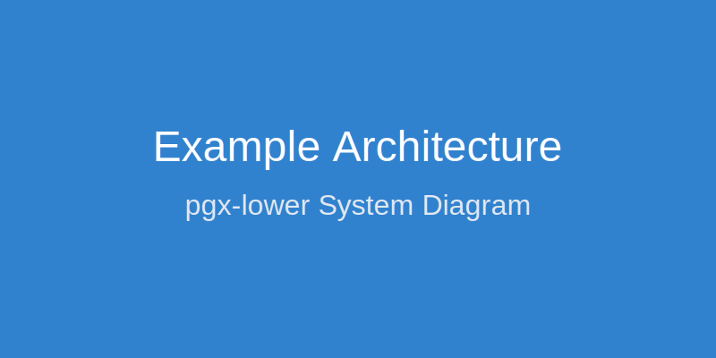

# Blog

Welcome to the pgx-lower blog. Here we'll share updates, insights, and technical deep-dives.

## Getting Started

This is a placeholder blog post. Add your content here!

### Example Code

```sql
SELECT * FROM users WHERE active = true;
```

### Example Diagrams




### Key Points

- Blog posts are written in Markdown
- Supports syntax highlighting
- Images and diagrams can be embedded
- Academic styling matches the rest of the site


## Example Diagram
Hello world


